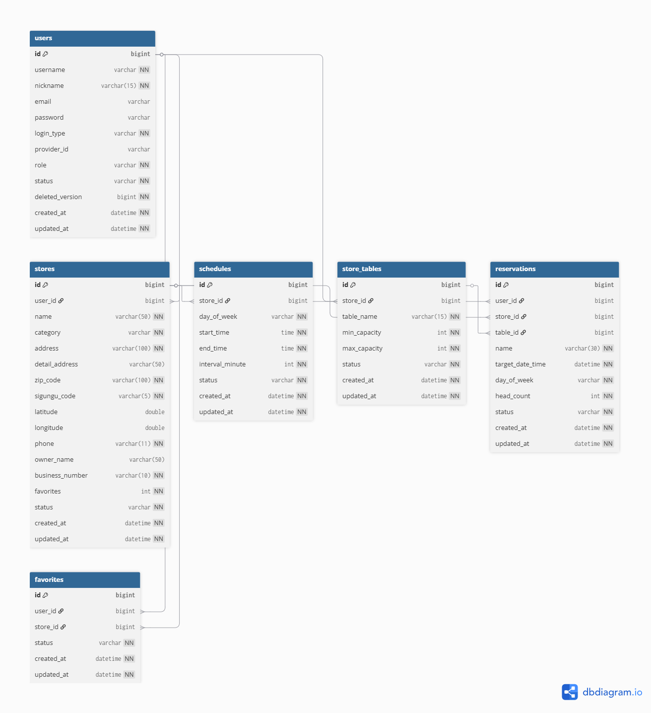
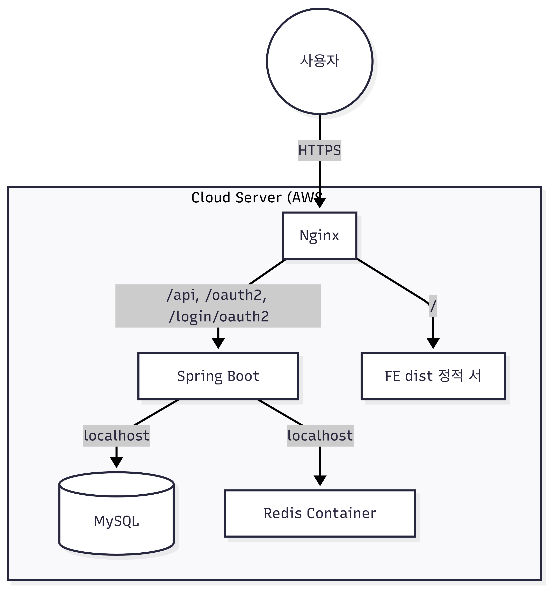

# 🍽️ YarmSpot — 온라인 식당 예약 시스템

> 유저·점주·관리자 3계층 권한 구조의 식당 예약 플랫폼 백엔드 API 서버

**배포 주소**: https://yarmspot.store  
**Swagger**: https://yarmspot.store/swagger-ui/index.html _(dev 환경에서만 활성화)_

---

## 주요 기능

### 유저
- 로컬 회원가입 / 로그인 + Google · Kakao · Naver 소셜 로그인
- 반경 3km 가게 지도 검색, 키워드·카테고리·지역 필터 검색, 인기 가게 TOP 6 조회
- 예약 가능 타임슬롯 조회 → 예약 신청 → 예약 취소
- 관심 가게 등록·해제
- 닉네임·이메일·비밀번호 변경, 회원 탈퇴

### 점주
- 가게 등록 시 USER → OWNER 자동 승격
- 가게 정보·상태 관리 (READY / OPEN / HIDDEN)
- 요일별 영업시간·예약 슬롯 간격 설정
- 테이블 그룹 등록·수정 (수용 인원, 수량)
- 예약 목록 조회, 예약 상태 일괄 변경 (REJECTED · VISITED · NO_SHOW)
- 가게 일괄 삭제

### 관리자
- 유저·가게·예약 전체 검색 및 상세 조회
- 유저 강제 탈퇴 (영구 정지)
- 서버 기동 시 한국문화정보원 API 기반 가게 데이터 자동 초기화

---

## 기술 스택

| 분류 | 기술 |
|---|---|
| Language | Java 21 |
| Framework | Spring Boot 4.0.1 |
| ORM | Spring Data JPA (Hibernate) |
| Security | Spring Security, JJWT 0.13.0, Spring OAuth2 Client |
| Database | MySQL, Redis |
| Migration | Flyway |
| External API | Kakao Local API, V-World API, 한국문화정보원 API |
| Infra | AWS EC2 (t3.micro), Nginx, GitHub Actions |
| Docs | SpringDoc OpenAPI 3.0.1 (Swagger UI) |
| Etc | Lombok, P6Spy, Spring Actuator |

---

## 아키텍처 / 설계

### 계층 구조

```
Controller
    └─► Facade        여러 Service를 조합하는 오케스트레이션 레이어
            └─► Service   단일 도메인의 데이터 접근 + 유효성 검사 + 트랜잭션
                    └─► Repository   JpaRepository + JPQL / Native Query
```

- **Service**는 자신의 도메인 Repository만 접근합니다. 도메인 간 협력이 필요한 경우 반드시 **Facade**에서 처리합니다.
- 모든 Facade · Service는 `@Transactional(readOnly = true)` 기본, 쓰기 메서드에 `@Transactional` 오버라이드 패턴을 사용합니다.

### 인증 구조

```
[로컬 로그인]  POST /api/auth/login
    → Access Token (응답 body)
    → Refresh Token (HttpOnly Cookie) + Redis 저장

[소셜 로그인]  GET /oauth2/authorization/{provider}
    → OAuth2 인증 완료 후 프론트로 리다이렉트 (?accessToken=...)

[토큰 갱신]   POST /api/auth/refresh
    → 쿠키 Refresh Token ↔ Redis 검증 → 새 Access Token 발급

[로그아웃]    POST /api/auth/logout
    → Access Token → Redis 블랙리스트 등록
    → Refresh Token Redis 삭제 + 쿠키 만료
```

- **Access Token** — 클라이언트 메모리 보관, 매 요청 헤더(`Authorization: Bearer`) 전송
- **Refresh Token** — HttpOnly 쿠키 + Redis 이중 검증으로 탈취 위험 최소화
- **블랙리스트** — 로그아웃된 Access Token을 남은 TTL만큼 Redis에 등록, 필터에서 매 요청마다 조회

### 동시성 제어

예약 생성·취소·테이블 수정 등 경합이 발생할 수 있는 흐름에서 **Pessimistic Write Lock** (3초 타임아웃)을 사용합니다.

```java
@Lock(LockModeType.PESSIMISTIC_WRITE)
@QueryHints({@QueryHint(name = "jakarta.persistence.lock.timeout", value = "3000")})
Optional<Store> findByIdWithLock(@Param("id") Long id);
```

`Store`, `User`, `Reservation` Repository에 동일 패턴 적용.

### 소프트 삭제 전략

| 엔티티 | 삭제 방식 | 특이사항 |
|---|---|---|
| User | `status=DELETED`, `deletedVersion=user.id` | `(username, deletedVersion)` 복합 유니크 → 탈퇴 후 재가입 허용 |
| Store | `status=SHUTDOWN` | 복구 불가 |
| Schedule / StoreTable / Favorite | `status=DELETED` | ACTIVE 복귀 가능 |

### ERD



### 가게 상태 전환 규칙

```
READY ──► OPEN     (활성 Schedule + 활성 StoreTable 이 모두 존재할 때만)
OPEN  ──► HIDDEN   (점주 직접 전환)
HIDDEN ──► OPEN / READY
OPEN/HIDDEN ──► SHUTDOWN  (삭제 흐름만, 직접 전환 불가)

Schedule 전체 삭제 또는 StoreTable 전체 삭제 → Store 자동 READY 복귀
```

### 배포 인프라



GitHub Actions(`main` 브랜치 push) → EC2 SSH → git pull → Gradle 빌드 → 재시작

---

## 패키지 구조

```
src/main/java/com/example/demo/
├── domain/
│   ├── admin/       관리자 API
│   ├── favorite/    관심 가게
│   ├── owner/       점주 API
│   ├── reservation/ 예약
│   ├── schedule/    영업시간
│   ├── store/       가게
│   ├── storeTable/  테이블
│   └── user/        유저
└── global/
    ├── auth/        로그인·토큰·OAuth2
    ├── config/      Security·JPA·Redis·CORS 설정
    ├── exception/   BusinessException·ErrorCode·GlobalExceptionHandler
    ├── filter/      JwtAuthenticationFilter
    ├── infra/       외부 API 클라이언트 (Kakao·VWorld·Culture)
    ├── init/        서버 기동 시 관리자·가게 데이터 초기화
    ├── provider/    JwtTokenProvider
    ├── security/    CustomUserDetails
    └── util/        JwtUtil·RedisUtil·SecurityUtil
```

---

## 배포 주소

| 구분 | URL |
|---|---|
| 서비스 | https://yarmspot.store |
| 백엔드 GitHub | https://github.com/codnjs042/Reservation-Project-BE |
| 프론트엔드 GitHub | https://github.com/codnjs042/Reservation-Project-FE |
